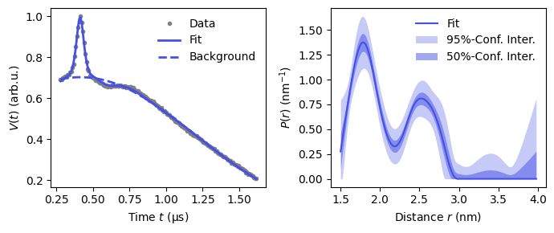

# Example 1
## Simple analysis of a RIDME trace using standard DeerLab tools

This example was shown and discussed during the RIDME tutorial @ EFEPR 9th Summer School, Geneva, 2023. The attached data is an actually measured experimental result.

### Introduction
Basic analysis of RIDME trace almost does not deviate from that of a 4p-DEER trace. The experimental signal $V(t)$ is represented as a product of intra-molecular dipolar form-factor $F(t)$ and intermolecular background decay $B(t)$
$$V(t) = F(t)\cdot B(t).$$

Although the theory of the form-factor is not the subject of the present example, it is worth to mention two important features that distinguish RIDME from DEER. By the design, the RIDME experiment does not deal directly with excitation of the B-spins. Since all species presented in the EPR spectrum are subject of the longitudinal ($T_1$) relaxation, RIDME is often called "infinite-bandwidth pump experiment". Thereby, the orientation selection of B-spins is almost negligible [*Ritsch PCCP*](https://www.sciencedirect.com/science/article/pii/S1090780719301715). Along with that, B-spins are normally fast relaxing species and, hence, have broad EPR spectra with significant anisotropic g-tensor. The dipolar coupling carries then also information on g-values, and powder patterns are more complicated [*Millikisyants JMR*](https://www.sciencedirect.com/science/article/pii/S1090780709002389), [*Abdullin Chemistry*](https://chemistry-europe.onlinelibrary.wiley.com/doi/full/10.1002/chem.201900977).

Another important difference is in the structure of the background factor. Besides the contribution from distant electrons (so-called dipolar background [Keller PCCP]) there is a substantial influence from close protons [*Kuzin PCCP*](https://pubs.rsc.org/en/content/articlehtml/2022/cp/d2cp03039j). For that reason, one actively uses stretched exponential function ($\exp(-(kt)^{d/3})$ a.k.a. $\exp(-(t/T_{m})^{\xi}$ etc; `dl.bg_strexp` in DeerLab) to fit the background. In fully protonated samples, as exploited in this demonstration, one may expect the power to be close to 2 ($\xi\approx 2$, or, $d\approx 6$).

### Code structure
Loading data and standard fitting in the first cell (attention: if you use DeerLab of version 1.0, replace `dl.ex_ridme` by `dl.ex_4pdeer`, or almost equivalently, use `t -= (tau1-d3)` instead of `t += d3` to get correct results).

Plotting in the second cell.

### Typical output


```r
Model parameters: 
=========== ======= ========================= ====== ====================================== 
 Parameter   Value   95%-Confidence interval   Unit   Description                           
=========== ======= ========================= ====== ====================================== 
 mod         0.294   (0.271,0.318)                    Modulation depth                      
 reftime     0.413   (0.413,0.414)              μs    Refocusing time                       
 decay       0.838   (0.801,0.875)             μs⁻¹   Decay rate                            
 stretch     2.049   (1.869,2.228)                    Stretch factor                        
 P           ...     (...,...)                 nm⁻¹   Non-parametric distance distribution  
 P_scale     0.995   (0.987,1.003)             None   Normalization factor of P             
=========== ======= ========================= ====== ====================================== 
```
Note that stretch parameter turn out indeed approximately 2. 

The original sample is a rigid copper-nitroxide ruler with the inter-spin distance of ~2.5 nm. However, the distance distribution looks broad and shifted to the shorted distances. This is a direct indication of exchange interaction, consequently, a more sophisticated analysis is required [*Ritsch, Keller PCCP*](https://pubs.rsc.org/en/content/articlehtml/2020/cp/d0cp03105d).

### Outlook

### License

Designed and prepared by Sergei Kuzin, ETH Zurich. Free to use, modify and share.