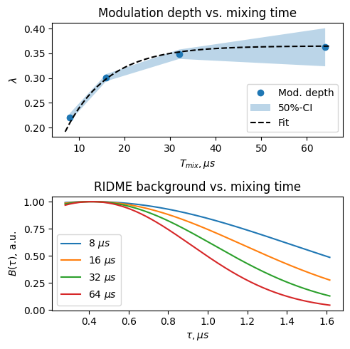

# Example 2
## Properties of RIDME traces versus mixing time

### Introduction
RIDME pulse sequence contains an additional degree of freedom, compared with DEER, namely, duration of mixing block. The longer the mixing time, the larger the probability of B-spin flip, therefore, the larger the expected modulation depth. Overall modulation depth is ideally described by

$$\lambda(T_\mathrm{mix}) = \frac{2S_B}{2S_B+1}(1 - \exp(-T_\mathrm{mix}/T_{1, B}))$$
where $S_B$ and $T_{1,B}$ are the spin and $T_1$-relaxation time of B-spin. In practice, this formula is not exact for high-spin systems ($\mathrm{Gd}^{3+}, \mathrm{Mn}^{2+}$ etc). And even for spin-1/2 cases the limiting value $\lambda(\infty)=1/2$ is hardly achievable.

However, mixing time cannot be very long. Due to the spectral diffusion mechanism, the background decay in RIDME gets steeper after increasing the mixing block duration. More details can be found in [*S. Kuzin, G. Jeschke, M. Yulikov, (2022), PCCP*](https://pubs.rsc.org/en/content/articlehtml/2022/cp/d2cp03039j).

In this example, we will get experimental modulation depths and backgrounds from a Cu-nitroxide ruler dissolved in H2O / H8-glycerol (detection on the nitroxide, 40 K). The data was acquired as a 2D-experiment in xEpr Bruker software and the second dimension corresponds to different mixing times in 5p-RIDME sequence.

### Code structure
The provided example is a Jupiter notebook with three cells. The first one contains typical data loading routine and building a simple dipolar model with the main dipolar pathway only. The backgound model is chosen `dl.bg_strexp`.

In the second cell, the `dl.fit` function is used for fitting of individual trace separately (no global fitting). The fit results are collected in `results` variable which allows for any post-analysis. The values of fitted modulation depths and their 50% confidence intervals are stored in `mod_depths`, respectively, `md_uncerts`. The backgrounds are recalculated based on the fitting output and stores as arrays in `bckgs`.

The last cell contains code for plotting. We have also added an emprirical fir of $\lambda(T_\mathrm{mix})$ and used the $T_1$-relaxation time of copper ion at 40 K determined from the inversion recovery. The fit function agrees well with the data, albeit the maximum modulation depth is lower than theoretical $0.5$.

### Typical output

### Outlook

One has access to all fitting results via, for example, `results[0].P`. Therefore, you can compare distance distributions and their uncertainties for different mixing times. Alternatively, you can try to perform a global fitting of the dataset assuming a unique distance distribution. More details are in the [DeerLab example](https://jeschkelab.github.io/DeerLab/auto_examples/intermediate/ex_global_fitting_4pdeer.html#sphx-glr-auto-examples-intermediate-ex-global-fitting-4pdeer-py) and the [DeerLab guide](https://jeschkelab.github.io/DeerLab/modeling_guide.html).

### License

Designed and prepared by Sergei Kuzin, ETH Zurich, 2023. Free to use, modify and share.