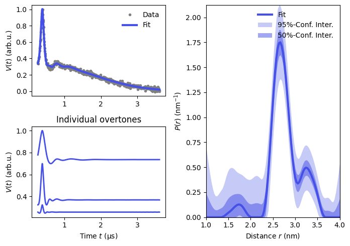

# Example 3
## Fitting a RIDME signal with dipolar overtones

Disclaimer: This example uses quite advanced features of DeerLab. We will build our own dipolar experiment that is not in the collection of pre-defined expretiments. Next, we do a number of model manipulations that are demanded by the theoretical description of the RIDME experiment. If you want to deeply understand the presented code, visit [DeerLab Modelling Guide](https://jeschkelab.github.io/DeerLab/modeling_guide.html) first.

The example is developed for DeerLab v1.1 or higher.

### Introduction
$V(t)=F(t)\cdot B(t)$.
$$F(t) = 1-\lambda_0 + \lambda_1 F_1(t) + \lambda_2 F_2(t) + ...$$

$$F(t) = 1-\lambda_0 + \sum_{j=1}^{N} \lambda_j F_1(jt)$$

From the intensity normalization condition we additionally get $\lambda_0 = \sum_{j=1}^{N} \lambda_j$ and we will call $\lambda_0$ a total modulation depth. Finally, we introduce normalized dipolar overtone coefficiens $P_j$ via the following relation $\lambda_j = \lambda_0\cdot P_j$. The goal of the correct data processing is to account for the dipolar overtones in the signal. Without this consideration, we would need to deal with phantom distances in the distance distribution. The apparent $P(r)$ is then
$$P_\text{app}(r) = \sum_{j=1}^{N} \lambda_j P_\text{true}(j^{1/3}r).$$


### Code structure
The code starts with a standard data loading to DeerLab. The cell after deals with building a correct RIDME experiment accounting for overtones. We will use a single-pathway method but extend it but announcing to DeerLab that more pathways with higher harmonics will be used. Above all, number of overtones is fixed in variable `Novertones`. An array of normalized overtones coefficients is defined as well. This particular set is adapted from [*K. Keller, M. Yulikov et al., (2017), PCCP*](https://pubs.rsc.org/en/content/articlehtml/2017/cp/c7cp01524k).

```r
my_ridme = dl.ExperimentInfo('5-pulse RIDME with overtones', 
                             reftimes, 
                             harmonics, 
                             pulselength, 
                             pathwaylabels, 
                             delays
                             )
```
After this step is done, we are ready to shape the dipolar model.
```r
Vmodel = dl.dipolarmodel(t, r, Bmodel=dl.bg_strexp, experiment=my_ridme)
```
`Vmodel` is now significantly redundant and incomplete simultaneously. Firstly, we should not allow different harmonics have different refocusing times, as this is unphysical. The application of the method `dl.link` fixes this:
```r
Vmodel = dl.link(Vmodel, reftime=[f'reftime{n+1}' for n in range(Novertones)])
```
Modulation depths of each harmonics ($\lambda_j$ from Introduction) already exist in the model as `lam1`, `lam2` etc. They are so far independent. We add then manually a parameter named `lam` to control all of them.
```r
Vmodel.addnonlinear(key='lam', 
                    lb=0, 
                    ub=1, 
                    par0=0.1, 
                    name='Modulation depth', 
                    unit='', 
                    description='Overall modulation depth'
                    )
```
And relate each $\lambda_j$ to $\lambda$ via `dl.relate`. Unfortunately, I had to use an elaborated pythonic way to implement this. Next piece of code allows for user avoiding any code manipulation of `Novertones` is changed.
```r
from functools import partial
relation = lambda lam, n: lam*Ps[n]
restraints = {f'lam{n+1}' : partial(relation, n=n) for n in range(Novertones)}
Vmodel = dl.relate(Vmodel, **restraints)
```

### Typical output


### Outlook

### License

Designed and prepared by Sergei Kuzin, ETH Zurich. Free to use, modify and share.